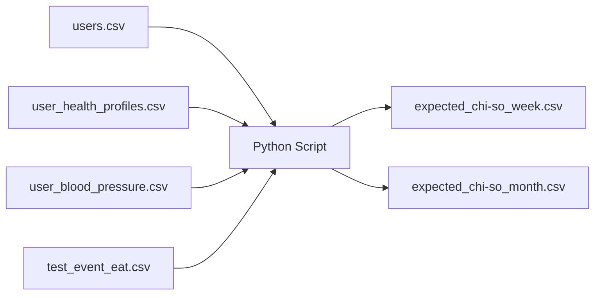

# Implementation Plan: Blood Pressure Test Data Generator

## Overview
Tạo dữ liệu test input đầy đủ cho 16 users và Python script để sinh expected output files theo công thức trong [DATA_DICTIONARY.md](file:///c:/Users/HLC_2021/Downloads/antigravity/koliaa/feature/bao_cao/csv/HA/DATA_DICTIONARY.md)

---

## Current State Analysis

### Files hiện có
| File | Users | Records |
|------|-------|---------|
| [users.csv](file:///c:/Users/HLC_2021/Downloads/antigravity/koliaa/feature/bao_cao/csv/HA/users.csv) | 4 (U01, U05, U06, U07) | 4 rows |
| [user_health_profiles.csv](file:///c:/Users/HLC_2021/Downloads/antigravity/koliaa/feature/bao_cao/csv/HA/user_health_profiles.csv) | 4 | 4 rows |
| [user_blood_pressure.csv](file:///c:/Users/HLC_2021/Downloads/antigravity/koliaa/feature/bao_cao/csv/HA/user_blood_pressure.csv) | 5 (U01-U07, U02 thêm) | 211 rows |
| [test_event_eat.csv](file:///c:/Users/HLC_2021/Downloads/antigravity/koliaa/feature/bao_cao/csv/HA/test_event_eat.csv) | 3 (U05, U06, U07) | 9 events |

### Test Cases yêu cầu: 27 TCs, 16 Users
Từ [TC_Bieu_Do_Huyet_Ap.csv](file:///c:/Users/HLC_2021/Downloads/antigravity/koliaa/feature/bao_cao/TC_Bieu_Do_Huyet_Ap.csv)

---

## Proposed Changes

### 1. Input Data Files

#### [MODIFY] [users.csv](file:///c:/Users/HLC_2021/Downloads/antigravity/koliaa/feature/bao_cao/csv/HA/users.csv)
Mở rộng từ 4 → 16 users:

| User | has_hypertension | Profile | Purpose |
|------|------------------|---------|---------|
| U01 | 1 | THA_diagnosed | kiem_soat 90% Tối ưu |
| U02 | 1 | THA_diagnosed | kiem_soat 66.7% Tốt, ARV 12, MEdiff +21 |
| U03 | 1 | THA_diagnosed | kiem_soat 33.3% Kém |
| U04 | 1 | THA_diagnosed | kiem_soat 9.5% Không KS |
| U05 | 2 | cao_chua_cdoan | bp_load 90.5% Gánh nặng |
| U06 | 3 | binh_thuong | bp_load 9.5% Bình thường |
| U07 | 4 | ko_on_dinh | bp_load 38.1%, ARV 18, MEdiff -20 |
| U08 | 5 | HA_thap | Hypotension 57.1% Rủi ro |
| U09 | 6 | khong_ro | BP Load 15% boundary |
| U10 | 3 | binh_thuong | Empty State - không data |
| U11 | 3 | binh_thuong | <2 lần đo/ngày |
| U12 | 5 | HA_thap | Hypotension 9.5% Ít khi |
| U13 | 5 | HA_thap | Hypotension 33.3% |
| U14 | 1 | THA_diagnosed | 10 lần đo/ngày |
| U15 | 2 | cao_chua_cdoan | Xu hướng +5 vs tuần |
| U16 | 1 | THA_diagnosed | Xu hướng -12 vs tháng |

---

#### [MODIFY] [user_health_profiles.csv](file:///c:/Users/HLC_2021/Downloads/antigravity/koliaa/feature/bao_cao/csv/HA/user_health_profiles.csv)
Thêm profiles cho U02-U04, U08-U16 với các ngưỡng riêng:
- U01-U04: has_hypertension=1 → cần `systolic_threshold_lower/upper`, `diastolic_threshold_lower/upper`
- U05-U16: has_hypertension≠1 → không cần ngưỡng cá nhân (dùng 140/90 chuẩn)

---

#### [MODIFY] [user_blood_pressure.csv](file:///c:/Users/HLC_2021/Downloads/antigravity/koliaa/feature/bao_cao/csv/HA/user_blood_pressure.csv)
Thêm records cho các user mới với pattern:
- **U02**: Morning high (145-155), Evening low (122-130) → MEdiff +21
- **U03**: 33.3% trong ngưỡng (7/21 records trong 120-130/70-80)
- **U04**: 9.5% trong ngưỡng (2/21 records)
- **U08**: 57.1% dưới 90/60 (12/21 records)
- **U09**: 15% vượt 140/90 (3/20 records) - boundary exact
- **U10**: Không có records
- **U11**: 1 lần đo/ngày x 7 ngày = 7 records
- **U12**: 9.5% dưới 90/60 (2/21 records)  
- **U13**: 33.3% dưới 90/60 (7/21 records)
- **U14**: 10 lần đo/ngày x 7 ngày = 70 records
- **U15**: Tuần này TB 130, tuần trước TB 125 → +5
- **U16**: Tháng này TB 120, tháng trước TB 132 → -12

---

#### [MODIFY] [test_event_eat.csv](file:///c:/Users/HLC_2021/Downloads/antigravity/koliaa/feature/bao_cao/csv/HA/test_event_eat.csv)
Thêm events cho U02 (thuốc):
- `uong_thuoc` lúc 06:30, BP đo 08:30-14:00 → HA giảm

---

### 2. Python Script

#### [NEW] [generate_expected_chi_so.py](file:///c:/Users/HLC_2021/Downloads/antigravity/koliaa/feature/bao_cao/csv/HA/generate_expected_chi_so.py)

Script Python để tính toán các chỉ số theo công thức trong DATA_DICTIONARY:

```python
# Công thức cần implement:

1. kiem_soat (has_hypertension = 1)
   = (count trong ngưỡng / total) × 100%
   Trong ngưỡng: sys_lower ≤ SYS ≤ sys_upper AND dia_lower ≤ DIA ≤ dia_upper

2. bp_load (has_hypertension = 2, 3, 4, 6)
   = (count vượt 140/90 / total) × 100%
   Vượt: SYS > 140 OR DIA > 90

3. hypotension_load (has_hypertension = 5)
   = (count dưới 90/60 / total) × 100%
   Dưới: SYS < 90 OR DIA < 60

4. arv (Average Real Variability)
   = Σ|SYSₖ₊₁ - SYSₖ| / (n-1)

5. mediff (Morning-Evening Difference)
   = SYS_sáng_TB - SYS_tối_TB
   Sáng: 04:00 - 10:00
   Tối: 20:00 - 00:00

6. xu_huong_tuan
   = SYS_TB_tuần_này - SYS_TB_tuần_trước

7. xu_huong_thang
   = SYS_TB_tháng_này - SYS_TB_tháng_trước

# Output format: CSV với columns
# user_id, user_profile, data_type, metric_name, calculation, value, expected_result, notes, srs_ref, period
```

---

### 3. Output Files (generated by Python)

#### [NEW] test_expected_chi-so_week_YYYY_M_D-YYYY_M_D.csv
#### [NEW] test_expected_chi-so_month_YYYY_M_D-YYYY_M_D.csv

Output format theo existing files with additional users.

---

## Verification Plan

### Automated Tests
1. Chạy Python script với dữ liệu hiện có (U01, U05, U06, U07)
2. So sánh kết quả với expected values trong DATA_DICTIONARY:
   - U01: kiem_soat 90%, ARV 5, MEdiff +7
   - U05: bp_load 90.5%, ARV 12, MEdiff +18
   - U06: bp_load 9.5%, ARV 6, MEdiff +5
   - U07: bp_load 38.1%, ARV 18, MEdiff -20

### Manual Verification
1. Review input data cho các user mới đảm bảo đúng pattern
2. Kiểm tra từng expected output đúng với phân loại theo ngưỡng BR-006

---

## Dependencies & Order



**Thứ tự thực hiện:**
1. Mở rộng `users.csv` (16 users)
2. Mở rộng `user_health_profiles.csv` (16 users)
3. Mở rộng `user_blood_pressure.csv` (data cho 16 users)
4. Mở rộng `test_event_eat.csv` (events cho U02)
5. Tạo Python script
6. Chạy script và verify
