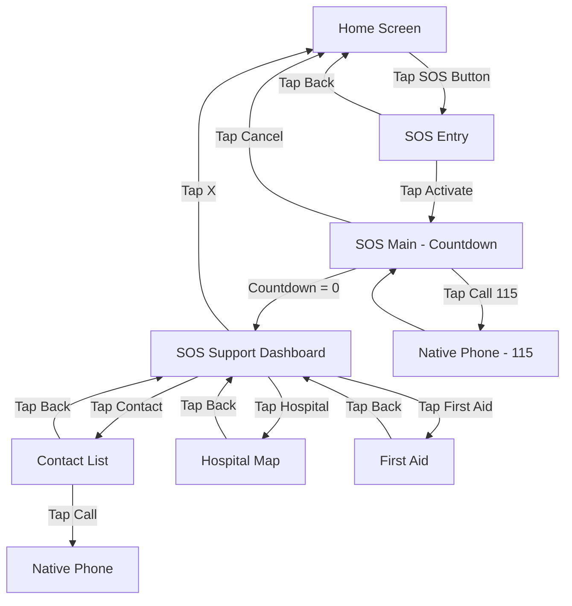
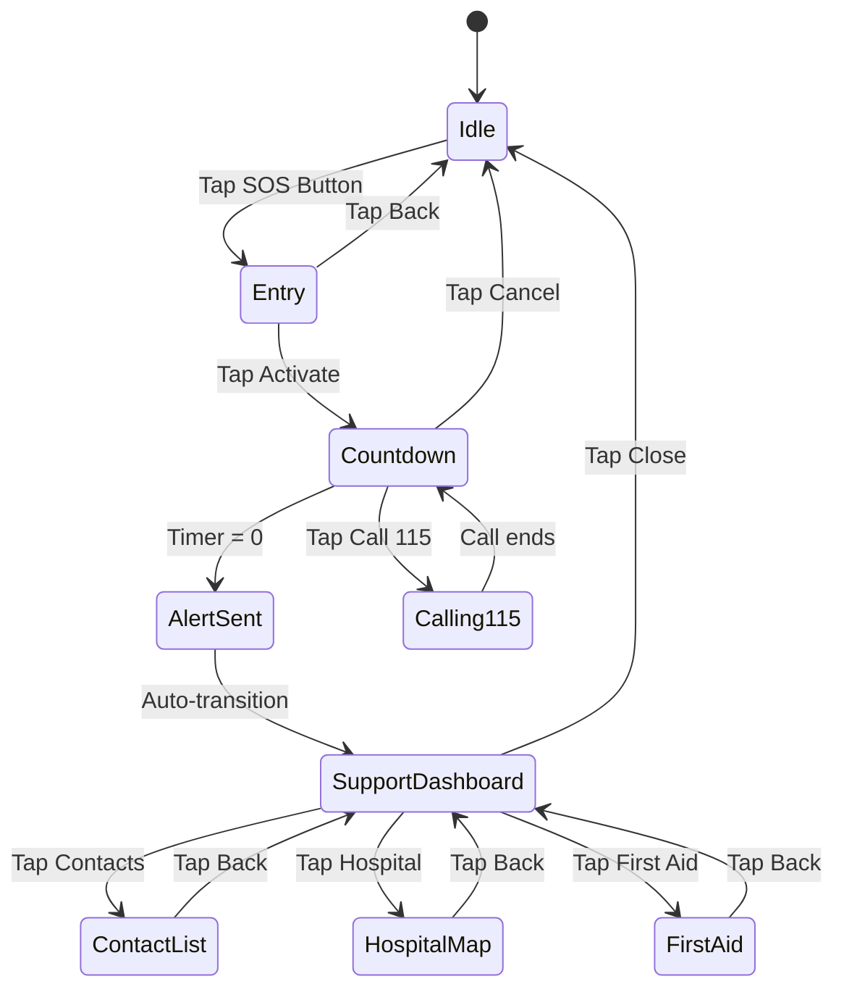

# SRS: SOS - Chức năng hỗ trợ khẩn cấp

**Version:** 2.1  
**Ngày tạo:** 2026-01-25  
**Ngày cập nhật:** 2026-01-27  
**Tác giả:** BA Team  
**Status:** Approved (Final)  

---

## 1. Giới thiệu

### 1.1 Mục đích

Tài liệu này mô tả chi tiết yêu cầu phần mềm cho chức năng **SOS - Hỗ trợ khẩn cấp** trong ứng dụng Kolia. Chức năng cho phép người bệnh nhanh chóng cầu cứu, liên lạc với người thân, gọi cấp cứu và tìm hỗ trợ y tế khi gặp tình huống khẩn cấp.

**Business Value:** Tăng độ an toàn và niềm tin của người dùng vào ứng dụng sức khỏe.

### 1.2 Phạm vi (In/Out)

**Trong scope (MVP):**
| # | Chức năng | Status |
|---|-----------|:------:|
| 1 | Màn hình SOS Entry (xác nhận trước khi kích hoạt) | ✅ |
| 2 | Màn hình SOS Main với đồng hồ đếm ngược 30s | ✅ |
| 3 | Gọi 115 (cấp cứu) - ưu tiên cao nhất | ✅ |
| 4 | Tự động gửi thông báo cầu cứu qua ZNS | ✅ |
| 5 | Gửi thông báo đến người thân và CSKH | ✅ |
| 6 | Escalation Flow tự động (20s per contact) | ✅ |
| 7 | Hủy SOS trong trường hợp ấn nhầm | ✅ |
| 8 | Offline Queue & Retry khi mất mạng | ✅ |
| 9 | Màn hình SOS Support Dashboard | ✅ |
| 10 | Gọi điện thoại cho người thân | ✅ |
| 11 | Tìm kiếm bệnh viện gần nhất (Google Maps) | ✅ |
| 12 | Hướng dẫn sơ cứu tại chỗ (Offline-capable) | ✅ |

**Ngoài scope:**
- ❌ Kết nối trực tiếp với hệ thống cấp cứu bên ngoài
- ❌ Tích hợp với thiết bị IoT y tế
- ❌ SOS History/Log
- ❌ **Zalo Video Call** (không có public API/deep link)

### 1.3 Thuật ngữ (Glossary)

| Thuật ngữ | Định nghĩa |
|-----------|------------|
| **SOS** | Tín hiệu cầu cứu khẩn cấp |
| **ZNS** | Zalo Notification Service - Dịch vụ gửi tin nhắn qua Zalo |
| **Escalation** | Quy trình tự động gọi tuần tự đến người thân khi không có ai trả lời |
| **CSKH** | Chăm sóc khách hàng |
| **Countdown** | Đồng hồ đếm ngược |
| **First Aid** | Hướng dẫn sơ cứu |
| **115** | Số cấp cứu y tế tại Việt Nam |

### 1.4 Dependencies & Assumptions

| Loại | Chi tiết | Status |
|------|----------|:------:|
| **Dependency** | Chức năng "Kết nối người thân" | 🔴 BLOCKER - Chưa có timeline |
| **Dependency** | ZNS Official Account | 🟡 Chưa setup |
| **Dependency** | Google Maps API | ✅ Available |
| **Dependency** | Location Permission | ✅ Đã xử lý trong Home Screen |
| **Assumption** | User đã cài đặt ít nhất 1 người thân | Required |
| **Assumption** | Device có khả năng gọi điện | Required |

---

## 2. Yêu cầu chức năng (Gherkin BDD)

### 2.1 Tính năng: Kích hoạt SOS

**User Story:** Là một người bệnh, tôi muốn kích hoạt SOS nhanh chóng, để nhận được sự giúp đỡ trong trường hợp khẩn cấp.

**Tiêu chí chấp nhận:**

#### Kịch bản 1: Kích hoạt SOS thành công (Happy Path)
```gherkin
Given người dùng đang ở màn hình chính
When người dùng nhấn nút SOS (floating button góc phải dưới)
Then hệ thống hiển thị màn hình SOS Entry với header "🚨 Bạn cần giúp đỡ?"

When người dùng nhấn "🆘 KÍCH HOẠT SOS"
Then hệ thống chuyển sang màn hình SOS Main
And bắt đầu countdown 30 giây
And phát Sound/Haptic feedback
  | Thời điểm | Sound | Haptic |
  | 0-20s | Beep nhẹ mỗi 5 giây | Rung nhẹ mỗi 5 giây |
  | 20-25s | Beep mỗi 2 giây | Rung nhanh hơn |
  | 25-30s | Beep liên tục | Rung liên tục |
*Ref: BR-SOS-001, BR-SOS-002*
```

#### Kịch bản 2: Countdown hoàn thành - Gửi cảnh báo
```gherkin
Given người dùng đang ở màn hình SOS Main
And countdown đang chạy
When countdown đạt 0 giây
Then hệ thống gửi ZNS Template 1 đến TẤT CẢ người thân đồng thời
And gửi alert đến CSKH qua API
And chia sẻ vị trí GPS hiện tại
And chuyển sang màn hình SOS Support Dashboard
And hiển thị "✅ Đã gửi cảnh báo thành công!"
*Ref: BR-SOS-003, BR-SOS-004*
```

#### Kịch bản 3: Hủy SOS
```gherkin
Given người dùng đang ở màn hình SOS Main
And countdown đang chạy
When người dùng nhấn "❌ HỦY"
Then hệ thống dừng countdown ngay lập tức
And KHÔNG gửi bất kỳ ZNS/alert nào
And quay về màn hình chính
And KHÔNG áp dụng cooldown
*Ref: BR-SOS-005*
```

#### Kịch bản 4: Gửi cảnh báo ngay (Skip countdown)
```gherkin
Given người dùng đang ở màn hình SOS Main
And countdown đang chạy
When người dùng nhấn "🆘 GỬI CẢNH BÁO NGAY"
Then hệ thống dừng countdown ngay lập tức
And gửi ZNS Template 1 đến TẤT CẢ người thân đồng thời
And gửi alert đến CSKH qua API
And chia sẻ vị trí GPS hiện tại
And chuyển sang màn hình SOS Support Dashboard
And hiển thị "✅ Đã gửi cảnh báo thành công!"
*Ref: BR-SOS-006*
```

> **📝 Clarification - Gửi cảnh báo ngay:**
> - Button này cho phép user skip countdown và gửi cảnh báo ngay lập tức
> - Dùng khi user cần hỗ trợ khẩn cấp và không muốn chờ 30s
> - Flow sau khi gửi giống hệt như khi countdown = 0

---

### 2.2 Tính năng: Escalation Flow

**User Story:** Là một người bệnh, tôi muốn hệ thống tự động gọi đến người thân, để có người đến giúp đỡ.

**Tiêu chí chấp nhận:**

#### Kịch bản 5: Escalation tự động
```gherkin
Given SOS đã được kích hoạt thành công
And user KHÔNG đang trong cuộc gọi 115
When escalation flow bắt đầu
Then hệ thống gọi đến người thân #1
And chờ 20 giây

When người thân #1 không trả lời (Busy/No Answer/Reject/Voicemail/Network Error)
Then hệ thống gọi đến người thân #2
And chờ 20 giây

When tất cả 5 người thân không trả lời
Then hệ thống gửi alert đến CSKH
And hiển thị prompt "Gọi 115 ngay"
*Ref: BR-SOS-007, BR-SOS-008*
```

#### Kịch bản 6: Escalation thành công
```gherkin
Given escalation đang chạy
When người thân #X trả lời cuộc gọi (Call Connected)
Then hệ thống dừng escalation ngay lập tức
And KHÔNG gọi đến các người thân còn lại
*Ref: BR-SOS-009*
```

#### Kịch bản 7: User đang gọi 115
```gherkin
Given SOS đã được kích hoạt
And user đang trong cuộc gọi 115
When escalation flow bắt đầu
Then hệ thống CHỈ gửi ZNS/Push (không auto-call)
And PAUSE escalation (không skip contacts)
And chờ user kết thúc cuộc gọi 115 để resume escalation
*Ref: BR-SOS-010*
```

#### Kịch bản 7a: Resume escalation sau khi 115 call kết thúc
```gherkin
Given SOS đã được kích hoạt
And escalation đã PAUSE do user đang gọi 115
When user kết thúc cuộc gọi 115
Then hệ thống resume escalation từ contact #1 (không skip)
And tiếp tục flow bình thường: gọi tuần tự với timeout 20s mỗi contact
*Ref: BR-SOS-010, BR-SOS-027*
```

> **📝 Clarification - Escalation Pause vs Skip:**
> - **PAUSE**: Contacts KHÔNG bị skip, sẽ được gọi khi resume
> - Lý do: User đang trong emergency call, không nên miss bất kỳ contact nào

#### Kịch bản 6a: Escalation call drop (connected < 10s)
```gherkin
Given escalation đang gọi người thân #X
And cuộc gọi được connect (Call Connected)
When cuộc gọi bị drop/disconnect trong vòng 10 giây
Then hệ thống KHÔNG tính là "đã trả lời"
And tiếp tục escalation đến người thân #X+1
*Ref: BR-SOS-009, BR-SOS-028*
```

> **📝 Clarification - Call Connected Threshold:**
> - Call phải sustain ≥ 10 giây để tính là "answered"
> - < 10s có thể là: voicemail pickup rồi hang up, accidental answer, network drop

---

### 2.3 Tính năng: Hỗ trợ sau SOS

**User Story:** Là một người bệnh, tôi muốn có các tùy chọn hỗ trợ thêm, để nhận được sự giúp đỡ phù hợp.

**Tiêu chí chấp nhận:**

#### Kịch bản 8: Gọi người thân từ Contact List
```gherkin
Given người dùng đang ở màn hình SOS Support Dashboard
When người dùng nhấn "Gọi người thân"
Then hệ thống chuyển sang màn hình Contact List

Given người dùng đang ở màn hình Contact List
When người dùng nhấn "📞 Gọi điện" cho người thân #X
Then hệ thống mở native phone app để gọi
And escalation skip người thân #X
*Ref: BR-SOS-011*
```

#### Kịch bản 9: Xem bệnh viện gần nhất
```gherkin
Given người dùng đang ở màn hình SOS Support Dashboard
When người dùng nhấn "Bệnh viện gần đây"
Then hệ thống mở màn hình Hospital Map
And hiển thị Google Maps với markers bệnh viện gần nhất
And sử dụng vị trí GPS hiện tại

When người dùng tap vào marker bệnh viện
Then hệ thống hiển thị bottom sheet với:
  | Element | Nội dung |
  | Tên bệnh viện | {Tên BV} |
  | Địa chỉ | {Địa chỉ đầy đủ} |
  | Khoảng cách | {X.X km} |
  | Button | "📍 Chỉ đường" → Mở Google Maps navigation |

Given không tìm thấy bệnh viện trong bán kính 10km
Then hệ thống hiển thị Empty State: "Không tìm thấy bệnh viện gần bạn. Vui lòng gọi 115."
*Ref: BR-SOS-012*
```

#### Kịch bản 9a: Hospital Map khi chưa cấp quyền vị trí
```gherkin
Given người dùng đang ở màn hình SOS Support Dashboard
And người dùng CHƯA cấp quyền truy cập vị trí cho ứng dụng
When người dùng nhấn "Bệnh viện gần đây"

# Case 1: Lần đầu xin quyền (chưa từng hỏi)
Given hệ thống chưa từng yêu cầu quyền vị trí
Then hệ thống hiển thị popup hệ điều hành xin cấp quyền Location
When người dùng chấp nhận
Then tiếp tục flow bình thường (KC9)
When người dùng từ chối
Then hệ thống hiển thị popup hướng dẫn (Case 2)

# Case 2: Đã từ chối trước đó (cần vào Settings)
Given người dùng đã từ chối quyền vị trí trước đó
Then hệ thống hiển thị popup hướng dẫn với:
  | Element | Nội dung |
  | Icon | 📍 (Location icon) |
  | Title | "Cho phép truy cập vị trí" |
  | Description | "Vui lòng bật quyền truy cập vị trí để tìm bệnh viện gần bạn.\n\nCác bước thực hiện:\nĐi đến Cài đặt → Kolia → Vị trí → Bật quyền truy cập" |
  | Button Primary | "Đi đến cài đặt" → Mở Settings của ứng dụng |
  | Button Secondary | "✕" (Đóng popup) → Quay về Dashboard |
*Ref: BR-SOS-031, Common Components - Popup yêu cầu cấp quyền*
```

> **📝 Clarification - Location Permission Flow:**
> - **Lần đầu**: Dùng popup hệ điều hành (iOS/Android native)
> - **Đã từ chối**: Dùng custom popup với hướng dẫn step-by-step
> - Pattern theo [SRS Common - Popup yêu cầu cấp quyền]


#### Kịch bản 10: Xem hướng dẫn sơ cứu
```gherkin
Given người dùng đang ở màn hình SOS Support Dashboard
When người dùng nhấn "Hướng dẫn sơ cứu"
Then hệ thống mở màn hình First Aid
And hiển thị categories: Tim mạch (CPR), Đột quỵ (F.A.S.T), Hạ đường huyết, Té ngã
And hiển thị disclaimer: "Thông tin sơ cứu chỉ mang tính tham khảo..."

Given First Aid content chưa sync
Then hệ thống hiển thị Empty State với illustration + text giải thích
*Ref: BR-SOS-013, BR-SOS-014*
```

---

### 2.4 Tính năng: Xử lý Offline

**User Story:** Là một người bệnh, tôi muốn SOS vẫn hoạt động khi mất mạng, để vẫn nhận được sự giúp đỡ.

**Tiêu chí chấp nhận:**

#### Kịch bản 11: SOS khi offline
```gherkin
Given người dùng đang offline (mất kết nối internet)
When người dùng kích hoạt SOS
Then hệ thống queue request với timestamp + location
And hiển thị "Đang chờ kết nối mạng..." + button "Gọi 115"
And button "Gọi 115" và "Gọi điện" VẪN hoạt động (không cần internet)

When người dùng có mạng trở lại
Then hệ thống auto-send cảnh báo đã queue
And retry tối đa 3 lần, mỗi lần cách 30 giây
*Ref: BR-SOS-015, BR-SOS-016*
```

#### Kịch bản 12: Không có kết nối mạng (Offline)
```gherkin
Given người dùng không có kết nối internet (WiFi/4G đều tắt)
When người dùng kích hoạt SOS
Then hệ thống detect offline status
And hiển thị màn hình ERR-01 với message: "Không có kết nối mạng"
And thông báo: "Bạn vẫn có thể gọi điện thoại"
And button "Gọi 115" vẫn hoạt động (sử dụng sóng di động)
And button "Gọi người thân" vẫn hoạt động
And hệ thống queue SOS request để gửi ZNS khi có mạng
*Ref: BR-SOS-017*
```

> **📝 Logic đơn giản hóa Network Detection:**
> | Trạng thái | Hành vi |
> |------------|---------|
> | **Online** (có WiFi hoặc 4G) | ✅ Hoạt động bình thường - Gọi điện + Gửi ZNS |
> | **Offline** (không có mạng) | ⚠️ Hiển thị ERR-01 - Vẫn gọi điện được, ZNS queue |
>
> **Lưu ý:** Hệ thống KHÔNG detect riêng Airplane Mode vì iOS không cho phép app detect trực tiếp trạng thái này. Thay vào đó, chỉ kiểm tra có kết nối internet hay không.

---

### 2.5 Tính năng: Pin thấp

**User Story:** Là một người bệnh với pin thấp, tôi muốn SOS được gửi nhanh hơn, để đảm bảo có thể liên lạc trước khi hết pin.

**Tiêu chí chấp nhận:**

#### Kịch bản 13: SOS khi pin < 10%
```gherkin
Given pin điện thoại < 10%
When người dùng kích hoạt SOS
Then countdown được rút ngắn xuống 10 giây (thay vì 30 giây)
And ZNS Template 1 được gửi sau 10 giây
*Ref: BR-SOS-018*
```

---

### 2.6 Tính năng: Xử lý lỗi (Error Handling)

**User Story:** Là một người bệnh, tôi muốn hệ thống xử lý các lỗi một cách hợp lý, để SOS vẫn hoạt động trong các tình huống bất thường.

**Tiêu chí chấp nhận:**

#### Kịch bản 14: SOS trong cooldown
```gherkin
Given người dùng đã gửi SOS thành công cách đây < 30 phút
When người dùng tap vào SOS button
Then hệ thống redirect thẳng về màn hình Dashboard (đã gửi thành công)
And KHONG hiển thị modal hoặc cho phép gửi thêm SOS
And Dashboard hiển thị timestamp "Đã gửi cách đây {X} phút"
*Ref: BR-SOS-019*
```

> **📝 Cooldown Logic (Updated):**
> - Duration: **30 phút** (tăng từ 5p để giảm spam)
> - **KHÔNG có bypass option** - bảo vệ người thân khỏi notification fatigue
> - User vẫn có thể gọi 115/người thân trực tiếp từ Dashboard

#### Kịch bản 15: ZNS gửi thất bại
```gherkin
Given SOS đã được kích hoạt thành công
And countdown đã hoàn thành
When ZNS API trả về lỗi (timeout, 5xx, rate limit)
Then hệ thống retry tự động 3 lần, mỗi lần cách 10 giây

When vẫn thất bại sau 3 lần retry
Then hệ thống:
  1. Log error + Gửi alert đến CSKH để manual follow-up
  2. Hiển thị màn hình FAILURE STATE với:
     | Element | Nội dung |
     | Icon | ⚠️ |
     | Title | "Không thể gửi cảnh báo" (RED) |
     | Subtitle | "Vui lòng thử lại hoặc gọi trực tiếp" |
     | Retry Button | "🔄 Thử lại" (secondary, nhỏ) |
     | Actions | 115, Người thân, Bệnh viện, Sơ cứu |

When user nhấn "Thử lại"
Then hệ thống retry gửi ZNS thêm 3 lần
And hiển thị loading state
*Ref: BR-SOS-021, BR-SOS-026*
```

> **📝 UX Rationale - Failure vs Pending State:**
> - **SAI:** Hiện "Đang gửi..." sau khi đã thất bại → gây confuse với Loading screen
> - **ĐÚNG:** Hiện rõ FAILURE + Retry button → user có control
> - Emergency actions vẫn available để user không bị blocked

#### Kịch bản 16: GPS timeout
```gherkin
Given SOS đã được kích hoạt
And hệ thống đang lấy vị trí GPS
When GPS không trả về kết quả trong 10 giây
Then hệ thống kiểm tra last known location:
  | Điều kiện | Hành động |
  | Last known ≤ 30 phút | Sử dụng vị trí này + warning "Vị trí có thể không chính xác" |
  | Last known > 30 phút | Treat như không có vị trí |
  | Không có last known | Gửi ZNS không có link + text "Không xác định được vị trí" |
*Ref: BR-SOS-022, BR-SOS-029*
```

> **📝 Clarification - Stale Location Threshold:**
> - 30 phút là ngưỡng để consider location "còn hợp lệ"
> - > 30 phút: User có thể đã di chuyển xa, gửi vị trí cũ có thể gây hại (người thân đi sai đường)
> - Industry reference: Uber, Google Maps sử dụng 30p - 2h threshold

#### Kịch bản 17: Server không phản hồi
```gherkin
Given SOS đã được kích hoạt
And countdown đã hoàn thành
When Server không phản hồi trong 5 giây
Then client-side gửi trực tiếp đến ZNS backup endpoint (nếu có)
And nếu không có backup → Queue request locally + Hiển thị "Đang chờ kết nối..."
And retry mỗi 30 giây khi có mạng
*Ref: BR-SOS-023*
```

#### Kịch bản 18: SOS khi chưa có người thân
```gherkin
Given người dùng chưa cài đặt người thân nào (chức năng "Kết nối người thân" chưa setup)
When người dùng kích hoạt SOS

Then hệ thống vẫn cho phép kích hoạt SOS
And hiển thị warning: "⚠️ Bạn chưa thêm người thân. Chỉ có thể gọi 115 và CSKH."

When countdown hoàn thành
Then hệ thống CHỈ gửi alert đến CSKH (không gửi ZNS)
And vẫn chia sẻ vị trí GPS

And Dashboard hiển thị: "Đã gửi đến bộ phận hỗ trợ"
And button "Gọi người thân" hiển thị badge "Chưa có"
When người dùng tap "Gọi người thân"
Then hiển thị Empty Contact Screen với CTA "Thêm người thân"
*Ref: BR-SOS-024*
```

#### Kịch bản 18a: Thêm contact trong SOS session
```gherkin
Given SOS đã được kích hoạt thành công
And user đang ở Dashboard
When user thêm người thân mới qua CTA "Thêm người thân"
Then người thân mới KHÔNG nhận ZNS của session hiện tại
And hiển thị toast: "Người thân đã thêm. Sẽ nhận thông báo trong lần SOS tiếp theo."
*Ref: BR-SOS-030*
```

> **📝 Clarification - Contact Add in Session:**
> - Tránh confuse flow trong emergency context
> - User có thể gọi trực tiếp contact mới thêm qua Contacts screen

---

## 3. Business Rules

| BR-ID | Category | Mô tả Rule | Trigger | Exception | Priority |
|-------|----------|------------|---------|-----------|:--------:|
| BR-SOS-001 | State Transition | Countdown bắt đầu ngay khi vào màn hình SOS Main | Khi user nhấn "Kích hoạt SOS" | - | 🔴 High |
| BR-SOS-002 | Notification | Sound/Haptic PHẢI bypass Do Not Disturb mode | Suốt countdown | - | 🔴 High |
| BR-SOS-003 | Notification | ZNS gửi đồng thời đến TẤT CẢ người thân | Countdown = 0 | - | 🔴 High |
| BR-SOS-004 | Integration | Gửi alert đến CSKH qua API (lần 1: auto notification) | Countdown = 0 | - | 🔴 High |
| BR-SOS-005 | State Transition | Hủy SOS không áp dụng cooldown | User nhấn Hủy | - | 🟡 Medium |
| BR-SOS-006 | State Transition | "Gửi cảnh báo ngay" skip countdown và gửi ZNS ngay lập tức | User nhấn "Gửi cảnh báo ngay" | - | 🔴 High |
| BR-SOS-007 | Limit/Constraint | Escalation RING timeout: 20 giây per contact (trước khi connect). Sau khi connect, không timeout | Mỗi cuộc gọi escalation | - | 🟡 Medium |
| BR-SOS-008 | Fallback/Recovery | Sau 5 người thân → CSKH (lần 2: escalation) → Prompt 115 | Không ai trả lời | - | 🔴 High |
| BR-SOS-009 | State Transition | Call Connected ≥ 10s → Dừng escalation. Call Connected < 10s rồi drop → Không tính là trả lời | Người thân trả lời | - | 🔴 High |
| BR-SOS-010 | State Transition | User đang gọi 115: PAUSE escalation (không skip), chỉ gửi ZNS. Resume từ contact #1 khi call kết thúc | Escalation + Call 115 | - | 🔴 High |
| BR-SOS-011 | State Transition | User gọi người thân #X → Escalation skip #X | User manual call | - | 🟡 Medium |
| BR-SOS-012 | Integration | Hospital Map sử dụng Google Maps Places API | Mở Hospital Map | GPS fallback cell tower | 🟡 Medium |
| BR-SOS-013 | Authorization | First Aid content từ CMS, cached offline | Mở First Aid | Empty state nếu chưa sync | 🟢 Low |
| BR-SOS-014 | Notification | Disclaimer bắt buộc hiển thị trong First Aid | Mở First Aid | - | 🔴 High |
| BR-SOS-015 | Fallback/Recovery | Offline: Queue + Auto-retry khi có mạng | Mất mạng | Max 3 lần, 30s interval | 🔴 High |
| BR-SOS-016 | State Transition | Gọi 115/điện thoại vẫn hoạt động offline (sóng di động vẫn bật) | Offline | - | 🔴 High |
| BR-SOS-017 | Fallback/Recovery | ~~REMOVED~~ (không detect Airplane Mode riêng - chỉ detect Online vs Offline) | - | - | - |
| BR-SOS-018 | Limit/Constraint | Pin < 10%: Countdown rút ngắn 10 giây | Pin < 10% | - | 🟡 Medium |
| BR-SOS-019 | Limit/Constraint | Cooldown 30 phút sau gửi SOS thành công. Trong cooldown → redirect về Dashboard, KHÔNG bypass | SOS sent | User vẫn gọi 115/người thân trực tiếp | 🔴 High |
| BR-SOS-020 | Fallback/Recovery | Server-client countdown tolerance: 5 giây | Server + Client timer | Server là source of truth | 🔴 High |
| BR-SOS-021 | Fallback/Recovery | ZNS fail: Retry 3 lần → Alert CSKH | ZNS API error | Manual follow-up | 🔴 High |
| BR-SOS-022 | Fallback/Recovery | GPS timeout 10s: Use last known location (≤ 30 phút) + Warning | GPS không phản hồi | Location > 30p hoặc không có → treat như không có vị trí | 🟡 Medium |
| BR-SOS-023 | Fallback/Recovery | Server timeout 5s: Client fallback → Queue locally | Server không phản hồi | Retry mỗi 30s | 🔴 High |
| BR-SOS-024 | Fallback/Recovery | Không có contacts: Vẫn cho SOS, chỉ gửi CSKH, hiển thị CTA thêm người thân | 0 contacts configured | - | 🔴 High |
| BR-SOS-025 | Notification | Khi user quay lại app sau gọi 115, hiển thị toast confirm ZNS đã gửi | User returns from 115 call | - | 🟡 Medium |
| BR-SOS-026 | Fallback/Recovery | ZNS Fail: Hiện FAILURE state với Retry button, không phải pending state | ZNS fail sau 3 retries | Retry thêm 3 lần khi user tap | 🔴 High |
| BR-SOS-027 | State Transition | Resume escalation từ contact #1 sau khi user kết thúc cuộc gọi 115 | 115 call ends | - | 🔴 High |
| BR-SOS-028 | Limit/Constraint | Call connected threshold: ≥ 10 giây để tính "answered". < 10s = not answered | Escalation call connected | - | 🟡 Medium |
| BR-SOS-029 | Limit/Constraint | Stale location threshold: Last known > 30 phút → treat như không có vị trí | GPS fallback | - | 🟡 Medium |
| BR-SOS-030 | State Transition | Contact mới thêm trong SOS session không nhận ZNS của session hiện tại | User add contact in session | Có thể gọi trực tiếp | 🟡 Medium |
| BR-SOS-031 | Authorization | Hospital Map: Lần đầu → popup OS xin quyền. Đã từ chối → popup hướng dẫn vào Settings | Mở Hospital Map khi chưa cấp Location | Ref: SRS Common Popup | 🟡 Medium |
| BR-SOS-032 | Fallback/Recovery | ~~REMOVED~~ (không detect Airplane Mode riêng - iOS không hỗ trợ) | - | - | - |

---

## 4. Validation Rules (Data Fields)

| Field | Business Rule | Ví dụ hợp lệ | Ví dụ không hợp lệ |
|-------|---------------|--------------|-------------------|
| Family Contact Phone | Số điện thoại Việt Nam (10-11 số) | 0901234567, 0281234567 | 123, abc |
| Location (GPS) | Latitude: -90 to 90, Longitude: -180 to 180 | 10.762622, 106.660172 | 999, -999 |
| Countdown Timer | 0-30 giây (hoặc 0-10 nếu pin < 10%) | 15, 5, 0 | -1, 31 |
| ZNS Template Variables | Non-empty strings | "Nguyễn Văn A", "10:30 25/01" | "", null |

---

## 5. Yêu cầu phi chức năng (NFR)

### 5.1 Performance

| Metric | Yêu cầu |
|--------|---------|
| SOS Entry → Main transition | < 500ms |
| Countdown accuracy | Server-client tolerance ≤ 5 giây |
| ZNS sending (API response) | < 3 giây sau countdown = 0 (send initiated, delivery là async) |
| First Aid content load | < 2 giây (cached) |
| Hospital Map load | < 3 giây |

> **📝 Clarification - ZNS Sending:**
> - **< 3 giây** là API response time (send initiated)
> - **Delivery confirmation** là async và không block UI
> - Nếu API response > 3s, hiện loading state

### 5.2 Security

| Yêu cầu | Chi tiết |
|---------|----------|
| Location data | Chỉ chia sẻ khi SOS được kích hoạt |
| ZNS encryption | Sử dụng HTTPS |
| CSKH API | Authenticated API calls |
| User consent | Đã đồng ý Location Permission |
| **Privacy Policy** | Hiển thị link Privacy Policy trong Settings |
| **Data Retention** | SOS events lưu trữ **90 ngày**, sau đó auto-delete |

### 5.3 Availability

| Yêu cầu | Chi tiết |
|---------|----------|
| Offline capability | First Aid cached locally |
| Phone calls | Không cần internet |
| Server-side countdown | Failover nếu client disconnect |
| ZNS retry | Max 3 lần, 30s interval |

### 5.4 Accessibility (Elderly-friendly)

| Yêu cầu | Chi tiết |
|---------|----------|
| Font size | **Min 16sp** (body text), **20sp** (headers) |
| Contrast ratio | **≥ 4.5:1** cho text, **≥ 3:1** cho UI elements |
| Button size | Min **48x48dp** touch target, easy to tap |
| Color | Đỏ (#DC2626) cho khẩn cấp, đủ contrast với nền |
| Sound/Haptic | Bypass DND, escalating intensity |

---

## 6. UI Specifications

### 6.1 Screen Inventory

| Screen ID | Screen Name | Description | Entry Points | Exit Points |
|-----------|-------------|-------------|--------------|-------------|
| SOS-00 | SOS Entry | Xác nhận trước kích hoạt | Home (SOS Button) | SOS-01, Home |
| SOS-01 | SOS Main (Countdown) | Countdown 30s + Actions | SOS-00 | SOS-02, Home |
| SOS-02 | SOS Support Dashboard | Các options hỗ trợ | SOS-01 (timeout) | SOS-03, SOS-04, SOS-05, Home |
| SOS-03 | Contact List | Danh sách người thân | SOS-02 | SOS-02, Native Phone |
| SOS-04 | Hospital Map | Bản đồ bệnh viện | SOS-02 | SOS-02 |
| SOS-05 | First Aid | Hướng dẫn sơ cứu | SOS-02 | SOS-02, SOS-05a..d |
| SOS-05a | First Aid - CPR | Hướng dẫn hồi sinh tim phổi | SOS-05 | SOS-05 |
| SOS-05b | First Aid - Stroke | Hướng dẫn F.A.S.T | SOS-05 | SOS-05 |
| SOS-05c | First Aid - Low Sugar | Hướng dẫn hạ đường huyết | SOS-05 | SOS-05 |
| SOS-05d | First Aid - Fall | Hướng dẫn té ngã | SOS-05 | SOS-05 |

### 6.1.1 Error State Screens

| Screen ID | Screen Name | Trigger | Actions |
|-----------|-------------|---------|----------|
| ERR-01 | Offline | Mất mạng | Gọi 115, Gọi người thân |
| ~~ERR-02~~ | ~~Airplane Mode~~ | ~~REMOVED - Option B: Không detect Airplane Mode riêng~~ | - |
| ~~ERR-02a~~ | ~~Airplane Mode + WiFi~~ | ~~REMOVED - Chỉ detect Online vs Offline~~ | - |
| ERR-03 | Cooldown | SOS < 30 phút | Redirect về Dashboard (không có modal) |
| ERR-04 | Loading | Đang gửi ZNS (< 3s) | Spinner + Progress |
| ERR-05 | Hospital Empty | Không có BV 10km | Gọi 115, Quay về |
| ERR-06 | First Aid Empty | Chưa sync | Gọi 115, Quay về |
| ERR-07 | ZNS Failed | ZNS fail sau 3 retries | Retry button, Emergency actions |

### 6.2 Screen Components Specification

| Screen | Component ID | Component Name | Type | Required | Constraints |
|--------|--------------|----------------|------|:--------:|-------------|
| SOS-00 | SOS-00-01 | Header | Text | ✅ | "🚨 Bạn cần giúp đỡ?" |
| SOS-00 | SOS-00-02 | Description | Text | ✅ | "Kích hoạt để gửi thông báo khẩn cấp đến người thân" |
| SOS-00 | SOS-00-03 | Activate Button | Button | ✅ | RED, large, prominent, text: "🆘 KÍCH HOẠT SOS" |
| SOS-00 | SOS-00-04 | Back Link | Text Link | ✅ | "← Quay lại" |
| SOS-01 | SOS-01-01 | Header | Text | ✅ | "🚨 SOS" |
| SOS-01 | SOS-01-02 | Countdown Timer | Visual + Number | ✅ | 30s → 0s |
| SOS-01 | SOS-01-03 | Description | Text | ✅ | "Tự động gửi sau {X}s" (dynamic với countdown) |
| SOS-01 | SOS-01-04 | Send Now Button | Button | ✅ | RED, largest, text: "🆘 GỬI CẢNH BÁO NGAY" |
| SOS-01 | SOS-01-05 | Cancel Button | Button | ✅ | Text: "❌ HỦY", Smaller, less prominent |
| SOS-02 | SOS-02-01 | Success Header | Text | ✅ | "✅ Đã gửi cảnh báo thành công!" |
| SOS-02 | SOS-02-02 | Status Info | Text | ✅ | Notification details |
| SOS-02 | SOS-02-03 | High Priority Actions | Button Group | ✅ | 115, Người thân |
| SOS-02 | SOS-02-04 | Medium Priority Actions | Button Group | ✅ | BV, Sơ cứu |
| SOS-02 | SOS-02-05 | Close Button | Icon Button | ✅ | X để đóng |

### 6.3 Screen States & Behaviors

| Screen/Component | State | Visual | Behavior | Trigger |
|------------------|-------|--------|----------|---------|
| SOS-01 Countdown | 0-20s | Normal animation | Beep nhẹ mỗi 5s | Timer |
| SOS-01 Countdown | 20-25s | Faster animation | Beep mỗi 2s | Timer |
| SOS-01 Countdown | 25-30s | Urgent animation | Beep liên tục | Timer |
| SOS-03 Zalo Button | N/A | REMOVED | Zalo Video Call moved to out-of-scope (no public API) | - |
| SOS-05 First Aid | Content synced | Show categories | Load from cache | Open screen |
| SOS-05 First Aid | Content NOT synced | Empty State | Show illustration + text | Open screen |
| SOS-02 Dashboard | ZNS Sent | Success header | Show "\u2705 Đã gửi cảnh báo thành công!" | ZNS success |
| SOS-02 Dashboard | ZNS Failed | ERR-07 state | Show Retry button + Emergency actions | ZNS fail after 3 retries |
| Escalation | User in 115 call | PAUSED | Chỉ gửi ZNS, không auto-call | User calling 115 |
| Escalation | Call drop < 10s | Continue | Gọi contact tiếp theo | Call connected < 10s |

### 6.4 Navigation Flow (Mermaid)



---

## 7. Flow Diagrams

### 7.1 Sequence Diagram - SOS Activation

```mermaid
sequenceDiagram
    participant User
    participant App
    participant Server
    participant ZNS
    participant CSKH
    participant Family

    User->>App: Tap SOS Button
    App->>App: Show SOS Entry
    User->>App: Tap "Kích hoạt SOS"
    App->>App: Start Countdown (30s)
    App->>Server: Notify SOS initiated
    Server->>Server: Start server-side countdown
    
    alt Countdown completes
        App->>Server: Request send alerts
        Server->>ZNS: Send Template 1 to ALL family
        ZNS-->>Family: ZNS Messages (parallel)
        Server->>CSKH: Send SOS Alert via API
        Server-->>App: Confirm sent
        App->>App: Show Support Dashboard
        
        loop Escalation (if no answer)
            Server->>Family: Auto-call #1
            alt No answer in 20s
                Server->>Family: Auto-call #2
            end
        end
    else User cancels
        User->>App: Tap "Hủy"
        App->>Server: Cancel SOS
        App->>App: Return to Home
    end
```



### 7.2 State Diagram - SOS States



---

## 8. Đặc tả nội dung & UX Writing

### 8.1 ZNS Templates

**Template 1: Tin nhắn chính (sau countdown)**
```
🚨 CẢNH BÁO KHẨN CẤP - KOLIA

{Tên người bệnh} vừa kích hoạt SOS lúc {HH:mm ngày DD/MM}.

📍 Vị trí: {Link Google Maps}

Vui lòng:
1. Gọi ngay cho {Tên}: {SĐT}
2. Nếu không liên lạc được, gọi 115
```

**Template 2: Tin nhắn escalation**
```
🚨 KHẨN CẤP - KOLIA

{Tên người bệnh} cần giúp đỡ!
SOS lúc {HH:mm} - Không ai trả lời.

📍 {Link Google Maps}

GỌI NGAY: {SĐT} hoặc 115
```

### 8.2 Error Messages

| Error Code | Message | Trigger |
|------------|---------|---------|
| ERR-SOS-001 | "Không có kết nối mạng. Đang chờ kết nối..." | Offline khi SOS |
| ~~ERR-SOS-002~~ | ~~REMOVED - Không detect Airplane Mode riêng~~ | - |
| ERR-SOS-003 | "Không thể lấy vị trí. Vui lòng bật GPS." | GPS disabled |
| ERR-SOS-004 | "Zalo chưa được cài đặt trên thiết bị." | Zalo not installed |
| ERR-SOS-005 | "Hướng dẫn sơ cứu đang được cập nhật..." | First Aid not synced |

### 8.3 Disclaimer (First Aid)

```
⚠️ THÔNG TIN CHỈ MANG TÍNH THAM KHẢO

Hướng dẫn sơ cứu này không thay thế sự chăm sóc y tế chuyên nghiệp.
Trong trường hợp khẩn cấp, hãy gọi 115 ngay lập tức.
```

---

## Appendix

### A.1 Revision History

| Version | Date | Author | Changes |
|---------|------|--------|---------|
| 1.0 | 2026-01-25 | BA Team | Initial SRS creation |
| 1.1 | 2026-01-25 | BA Team | Fixed 3 minor issues from audit: accessibility specs, privacy policy, data retention |
| 1.2 | 2026-01-25 | BA Team | QA Review fixes: clarify Offline vs Airplane mode, add 4 error scenarios (KC14-17), add 3 new BRs (BR-SOS-021..023), update cooldown exception |
| 1.3 | 2026-01-25 | BA Team | Final polish: Hospital Map marker tap behavior, SOS-00-02 exact copy |
| 1.4 | 2026-01-25 | BA Team | Prototype sync: Add 6 error state screens, 4 First Aid sub-screens, elderly-optimized description |
| 1.5 | 2026-01-25 | BA Team | Add KC18 + BR-SOS-024: SOS without contacts (graceful degradation) |
| 1.6 | 2026-01-26 | BA Team | Critical fixes: Sync button labels, clarify 115 call behavior, ZNS fail screen spec |
| 1.7 | 2026-01-26 | BA Team | PO Review v2 fixes: Cooldown 30p, xóa modal, redirect đến Dashboard, update ERR-03 |
| 1.8 | 2026-01-26 | BA Team | QA Manager Review v3 fixes: KC6a (call drop), KC7a (escalation resume), KC16 (stale GPS 30p), KC18a (contact in-session), BR-027..030, ERR-07 (ZNS Failed), Screen States updates |
| 1.9 | 2026-01-26 | BA Team | UX polish + Airplane+WiFi: đổi labels (Kích hoạt SOS, Gửi cảnh báo ngay), KC12a + BR-032 (Airplane+WiFi), ERR-02a, countdown text update |
| 2.0 | 2026-01-26 | BA Team | **Remove Zalo Video Call** - moved to out-of-scope do không có public API/deep link (technical research confirmed) |
| 2.1 | 2026-01-27 | BA Team | **Option B: Remove Airplane Mode detection** - iOS không cho phép app detect trực tiếp Airplane Mode. Đơn giản hóa: chỉ kiểm tra Online vs Offline. Đã xóa: KC12/12a, BR-017/032, ERR-02/02a, ERR-SOS-002 |

### A.2 Open Questions

- [ ] Timeline cụ thể của feature "Kết nối người thân"?
- [ ] ZNS OA khi nào được setup?
- [ ] CSKH API endpoint specification?

### A.3 Cross-Feature Dependencies

| Feature bị ảnh hưởng | Loại thay đổi | CR ID | Priority | Status |
|---------------------|---------------|-------|----------|--------|
| Home Screen | Minor - Thêm floating SOS button | - | 🟢 Nice-to-have | In SRS |
| Kết nối người thân | Dependency | - | 🔴 Blocker | Pending |

### A.4 Blocked By

> ⚠️ **Dev Team lưu ý:** Feature này KHÔNG THỂ deploy nếu các items sau chưa hoàn thành:

- [ ] **Kết nối người thân:** Feature cho phép user quản lý danh sách người thân (tối đa 5 người)
- [ ] **ZNS OA Setup:** Zalo Official Account cần được setup và approve

### A.5 Related Documents

- [raw_request.md](../01_input/sos/raw_request.md)
- [senior_po_review.md](../01_input/sos/senior_po_review.md)
- [medical_review.md](../01_input/sos/medical_review.md)
- [impact_assessment.md](../04_impact/sos/impact_assessment.md)
