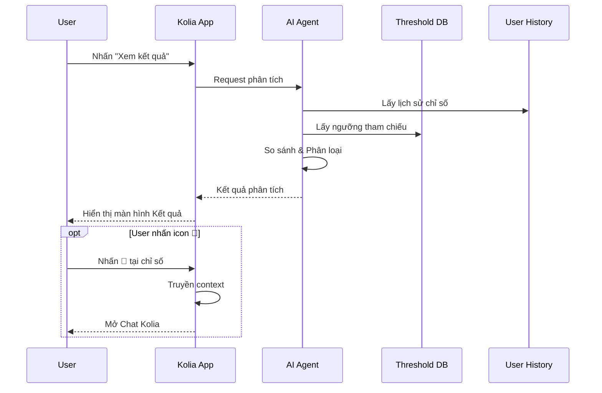

# SRS: Phân tích Kết quả Tái khám

> **Version:** 1.2
> **Ngày:** 26/01/2026
> **Author:** BA Team (AI-assisted)
> **Feature Parent:** Tái Khám (MVP 0.3)

---

## 1. Giới thiệu

### 1.1 Mục đích
Mở rộng chức năng "Kết quả phân tích" hiện có để cung cấp phân tích chi tiết, cá nhân hóa kết quả xét nghiệm dựa trên ngưỡng tham chiếu từ nhiều nguồn y khoa uy tín.

### 1.2 Phạm vi

**Trong phạm vi (In Scope):**
| # | Chức năng |
|---|-----------|
| 1 | Hiển thị section "Thông tin chung" mới (Ngày khám, Chuyên khoa, BS, CSYT) |
| 2 | Phân tích chỉ số theo ngưỡng tham chiếu từ 3 nguồn (Phiếu XN → Cá nhân hóa → Quốc tế) |
| 3 | Phân loại tiến triển (Cải thiện / Duy trì tốt / Cần chú ý) |
| 4 | Hiển thị nguồn ngưỡng (ADA, ESC, KDIGO...) |
| 5 | Nhận xét AI về từng chỉ số |
| 6 | Text-to-Speech (TTS) cho các sections |
| 7 | Icon 💬 CHỈ tại chỉ số "Cần chú ý" → mở chat Kolia với context |
| 8 | Disclaimer pháp lý cuối màn hình |

**Ngoài phạm vi (Out of Scope):**
| # | Chức năng | Lý do |
|---|-----------|-------|
| 1 | Phân tích NỘI DUNG ảnh siêu âm/X-quang | Yêu cầu AI khác (Lưu ý: vẫn DETECT để skip, xem Kịch bản 7) |
| 2 | Sửa giá trị nhận diện sai | Chấp nhận rủi ro trong phase này |

### 1.3 Thuật ngữ (Glossary)

| Thuật ngữ | Định nghĩa |
|-----------|------------|
| **Ngưỡng tham chiếu** | Giá trị chuẩn để so sánh chỉ số (từ phiếu, cá nhân hóa, hoặc quốc tế) |
| **Cá nhân hóa** | Điều chỉnh ngưỡng theo bệnh nền/độ tuổi của người dùng |
| **Phân loại tiến triển** | Đánh giá chỉ số: Cải thiện / Duy trì tốt / Cần chú ý |
| **TTS** | Text-to-Speech - Đọc nội dung bằng giọng nói |

### 1.4 Dependencies & Assumptions

**Dependencies:**
- Feature "Thu thập TT/Thiết lập hồ sơ" (bệnh nền, tuổi, giới tính)
- Feature "Tái Khám" hiện có (màn hình Kết quả phân tích)
- AI Agent (OCR + phân tích)

**Assumptions:**
- Người dùng đã có hồ sơ bệnh nền
- AI Agent đã có khả năng OCR phiếu xét nghiệm
- Threshold Database sẽ được team AI/Backend xây dựng

---

## 2. Yêu cầu chức năng (Gherkin BDD)

### Tính năng: Hiển thị Thông tin chung

**User Story:** Là một người dùng, tôi muốn xem thông tin chung về lần khám, để nắm được bối cảnh kết quả.

**Tiêu chí chấp nhận:**

**Kịch bản 1 (Happy Path): Hiển thị đầy đủ thông tin chung**
```gherkin
Given người dùng đang ở màn hình "Kết quả phân tích"
When AI đã phân tích xong phiếu kết quả
Then hệ thống hiển thị section "Thông tin chung" gồm:
  | Field | Giá trị |
  | Ngày khám | [OCR từ phiếu hoặc ngày upload] |
  | Chuyên khoa | [OCR từ phiếu] |
  | Bác sĩ | [OCR từ phiếu hoặc "Không có thông tin"] |
  | Cơ sở y tế | [OCR từ phiếu] |
And mỗi field không nhận diện được hiển thị "Không có thông tin"
```
*Ref: BR-001*

---

### Tính năng: Phân tích Tiến triển Chỉ số

**User Story:** Là một người dùng có bệnh mãn tính, tôi muốn biết chỉ số của tôi đang tốt lên hay xấu đi, để có hành động phù hợp.

**Tiêu chí chấp nhận:**

**Kịch bản 2: Phân loại chỉ số theo ma trận**
```gherkin
Given người dùng có lịch sử chỉ số từ lần khám trước
And hệ thống có ngưỡng tham chiếu cho chỉ số
When AI phân tích kết quả
Then hệ thống phân loại mỗi chỉ số theo ma trận:
  | So với ngưỡng | So với lần trước | Phân loại |
  | Trong ngưỡng | Cải thiện | ✅ Cải thiện |
  | Trong ngưỡng | Bình thường | 💚 Duy trì tốt |
  | Trong ngưỡng | Xấu đi | ⚠️ Cần chú ý |
  | Ngoài ngưỡng | Cải thiện | ⚠️ Cần chú ý (có cải thiện) |
  | Ngoài ngưỡng | Bình thường/Xấu đi | ⚠️ Cần chú ý |
And hiển thị nguồn ngưỡng (VD: "Theo ADA 2024")
```
*Ref: BR-002, BR-003*

**Kịch bản 3: Không có lịch sử**
```gherkin
Given người dùng lần đầu khám chuyên khoa này
When AI phân tích kết quả
Then mỗi card chỉ số vẫn hiển thị dòng "Lần khám trước"
And giá trị hiển thị: "Chưa có"
And chỉ so sánh với ngưỡng tham chiếu (không có phân loại Cải thiện/Xấu đi)
```
*Ref: BR-004*

**Kịch bản 4: Chỉ số không có ngưỡng**
```gherkin
Given có chỉ số mà hệ thống chưa có ngưỡng tham chiếu
When AI phân tích kết quả
Then hiển thị giá trị chỉ số
And dòng "Mức tiêu chuẩn" hiển thị: "Chưa có ngưỡng tham chiếu"
And ghi chú bên dưới: "Vui lòng tham khảo ý kiến bác sĩ."
And không phân loại (Cải thiện/Chú ý/Duy trì)
```
*Ref: BR-005*

---

### Tính năng: Chat Kolia về Chỉ số

**User Story:** Là một người dùng, tôi muốn hỏi thêm về một chỉ số cụ thể, để hiểu rõ hơn ý nghĩa và hành động cần làm.

**Tiêu chí chấp nhận:**

**Kịch bản 5: Nhấn icon chat**
```gherkin
Given người dùng đang ở màn hình "Kết quả phân tích"
And các chỉ số phân loại "Cần chú ý" có icon 💬 bên cạnh
When người dùng nhấn vào icon 💬 của chỉ số "HbA1c" (đang ở trạng thái Cần chú ý)
Then hệ thống mở Chat Kolia với context:
  | Field | Value |
  | Chỉ số | HbA1c |
  | Giá trị | 7.2% |
  | Ngưỡng | < 7% (ADA) |
  | Phân loại | Cần chú ý |
And Kolia sẵn sàng trả lời câu hỏi về chỉ số này
```
*Ref: BR-006*

---

### Tính năng: Error Handling

**User Story:** Là một người dùng, tôi muốn biết khi có lỗi xảy ra, để có thể xử lý phù hợp.

**Tiêu chí chấp nhận:**

**Kịch bản 6 (Error): OCR không nhận diện được kết quả**
```gherkin
Given người dùng upload ảnh phiếu kết quả
When AI không thể OCR được nội dung hoặc chỉ đọc được một phần (ảnh mờ, tối, sai góc, không phải phiếu kết quả)
Then hệ thống hiển thị cảnh báo: "Không nhận diện được kết quả tái khám từ ảnh"
And hiển thị text hướng dẫn: "Vui lòng nhấn vào nút thử lại để chụp/ tải lên ảnh chụp giấy tờ kết quả khám rõ nét và hợp lệ"
And hiển thị nút "Thử lại"
And không hiển thị màn hình Kết quả phân tích
```
*Ref: BR-011*

**Kịch bản 7 (Edge): Upload nhiều trang (bao gồm ảnh không hỗ trợ)**
```gherkin
Given người dùng upload nhiều ảnh (multi-page phiếu kết quả)
When AI phân tích xong tất cả các trang
Then hệ thống gộp kết quả từ các trang hợp lệ
And hiển thị tổng hợp trên màn hình Kết quả phân tích

# Case 1: Tất cả ảnh đều hợp lệ
And ghi chú: "Đã phân tích X/X trang"

# Case 2: Có ảnh siêu âm/X-quang trong số trang
And nếu có n trang là siêu âm/X-quang:
  - Ghi chú: "Đã phân tích X-n/X trang"  
  - Hiển thị lý do: "Ảnh siêu âm/X-quang chưa được hỗ trợ trong phiên bản này."
```
*Ref: BR-012, BR-013*

**Kịch bản 8 (Error): Network/Timeout**
```gherkin
Given người dùng đang chờ kết quả phân tích
When xảy ra lỗi mạng hoặc timeout (>15 giây)
Then hệ thống hiển thị: "Không thể kết nối. Vui lòng kiểm tra mạng và thử lại."
And hiển thị nút "Thử lại"
```
*Ref: BR-014*

**Kịch bản 9 (Edge): User chưa có hồ sơ bệnh nền**
```gherkin
Given người dùng mới, chưa thiết lập hồ sơ bệnh nền
When AI phân tích kết quả
Then hệ thống TỰ ĐỘNG sử dụng ngưỡng quốc tế mặc định (WHO, ADA, ESC...)
And hiển thị kết quả phân tích bình thường (không ghi chú, không yêu cầu thiết lập hồ sơ)
```
*Ref: BR-015*

---

## 3. Business Rules (BẮT BUỘC)

| BR-ID | Category | Mô tả Rule | Trigger | Exception | Priority |
|-------|----------|------------|---------|-----------|----------|
| BR-001 | Display | Thông tin chung: Nếu không OCR được field, hiển thị "--" | Sau khi AI phân tích xong | - | Medium |
| BR-002 | Logic | Thứ tự ưu tiên nguồn: Phiếu XN → Cá nhân hóa → Tiêu chuẩn quốc tế | Khi so sánh chỉ số | - | High |
| BR-003 | Display | Luôn hiển thị nguồn ngưỡng (VD: "Theo ADA 2024") | Với mọi chỉ số có ngưỡng | - | High |
| BR-004 | Fallback | Nếu không có lịch sử, hiển thị "Chưa có dữ liệu lịch sử để so sánh" | Lần khám đầu tiên | - | Medium |
| BR-005 | Fallback | Nếu chỉ số không có trong DB ngưỡng, ghi "Chưa có ngưỡng tham chiếu" | Chỉ số không recognize | - | Medium |
| BR-006 | Navigation | Icon 💬 CHỈ hiển thị với chỉ số "Cần chú ý" → mở Chat Kolia với context | User nhấn icon | - | Medium |
| BR-007 | Safety | AI KHÔNG TỰ khuyến nghị liều thuốc, chỉ hiển thị đơn thuốc từ OCR | Với mọi nội dung thuốc | - | High |
| BR-008 | Safety | AI KHÔNG chẩn đoán bệnh (VD: "Bạn bị tiểu đường") | Với mọi nhận xét | - | High |
| BR-009 | Display | Disclaimer bắt buộc cuối màn hình | Luôn luôn | - | High |
| BR-010 | Feature | TTS chỉ hoạt động khi có kết nối mạng | Khi user nhấn 🔊 | Offline: hiển thị "TTS cần kết nối mạng" | Medium |
| BR-011 | Error | OCR không nhận diện được: Hiển thị cảnh báo + hướng dẫn + nút "Thử lại", không hiển thị màn hình kết quả | Ảnh mờ/tối/sai góc/không hợp lệ | - | High |
| BR-012 | Edge | Multi-page: Gộp kết quả từ các trang hợp lệ + ghi chú "Đã phân tích X/X trang" | Upload nhiều ảnh | - | Medium |
| BR-013 | Edge | Ảnh siêu âm/X-quang trong multi-page: Ghi chú "Đã phân tích X-n/X trang" + lý do không hỗ trợ | AI detect loại ảnh | - | Medium |
| BR-014 | Error | Network/Timeout (>15s): Hiển thị lỗi + nút Thử lại | Mất kết nối | - | High |
| BR-015 | Fallback | Nếu chưa có hồ sơ bệnh nền → Dùng ngưỡng quốc tế mặc định | User mới, chưa có profile | - | Medium |

---

## 4. Nguồn ngưỡng tham chiếu

### 4.1 Mapping Nguồn theo Nhóm Chỉ số

| Nhóm chỉ số | Nguồn ưu tiên | Ghi chú |
|-------------|---------------|---------|
| Công thức máu (RBC, HGB, WBC, PLT, HCT) | **WHO** | Ngưỡng chung |
| Đường huyết (Glucose, HbA1c, Fructosamine) | **ADA / EASD** | ADA cập nhật hàng năm |
| Mỡ máu (LDL, HDL, Triglyceride, Cholesterol) | **ESC / AHA** | - |
| Huyết áp | **ACC/AHA** 2017 | - |
| Chức năng thận (Creatinine, eGFR, BUN) | **KDIGO** 2021 | - |
| Chức năng gan (ALT, AST, GGT, Bilirubin) | **AASLD / EASL** | - |
| Tuyến giáp (TSH, FT3, FT4) | **ATA** | - |
| Viêm & Tim mạch (CRP, hs-CRP, Troponin) | **ESC / ACC** | - |
| Acid Uric (Gout) | **ACR** | - |
| Chỉ số khác | **WHO** | Fallback |

### 4.2 Cá nhân hóa theo Bệnh nền

| Nhóm bệnh nền | Chỉ số | Ngưỡng cá nhân hóa | Nguồn |
|---------------|--------|-------------------|-------|
| Tiểu đường | HbA1c | < 7.0% (< 8% người già) | ADA / Bộ Y tế VN |
| Tăng huyết áp | BP | < 130/80 mmHg | ESC / AHA / Bộ Y tế |
| Mỡ máu (Sau đột quỵ) | LDL | < 1.4 mmol/L | ESC |
| Suy thận mạn | eGFR | Duy trì ổn định | KDIGO |
| Viêm gan B | HBV-DNA | Undetectable | AASLD / Bộ Y tế |
| Mang thai | Glucose, BP | Ngưỡng riêng | ACOG |
| Người > 65 tuổi | HbA1c | 7-8% chấp nhận | ADA Geriatric |

---

## 5. Yêu cầu phi chức năng (NFR)

### 5.1 Performance
- Thời gian phân tích AI: ≤ 10 giây
- TTS response: ≤ 2 giây

### 5.2 Security
- Dữ liệu y tế mã hóa end-to-end
- Không lưu ảnh gốc sau khi phân tích

### 5.3 Availability
- Uptime: 99.5%
- Fallback nếu AI không available: Hiển thị raw data

---

## 6. UI Specifications

### 6.1 Screen Inventory

| Screen ID | Screen Name | Description | Entry Points | Exit Points |
|-----------|-------------|-------------|--------------|-------------|
| SCR-001 | Kết quả phân tích | Màn hình chính hiển thị kết quả | Xem kết quả từ Lịch đã qua | Hoàn thành, Chat Kolia |

### 6.2 Screen Components

| Component ID | Component Name | Type | Description |
|--------------|----------------|------|-------------|
| CMP-001 | Thông tin chung | Card | **NEW** - Hiển thị Ngày, Chuyên khoa, BS, CSYT |
| CMP-002 | Tóm tắt | Card | Existing - Checklist điểm nổi bật |
| CMP-003 | Phân tích tiến triển | Card | Existing - 3 nhóm Cải thiện/Duy trì/Chú ý |
| CMP-004 | Khuyến nghị | Card | Existing - Thuốc, Dinh dưỡng, Lịch TK |
| CMP-005 | Icon 💬 | Icon Button | **NEW** - CHỈ tại chỉ số "Cần chú ý" → mở chat |
| CMP-006 | Disclaimer | Text | **NEW** - Cuối màn hình |
| CMP-007 | Mascot Kolia | Image + Button | Existing |

### 6.3 Component States

| Component | State | Visual | Behavior |
|-----------|-------|--------|----------|
| Icon 💬 | Default | Xám nhạt | - |
| Icon 💬 | Tap | Highlight | Mở Chat Kolia |
| Icon 🔊 TTS | Default | Xám | - |
| Icon 🔊 TTS | Playing | Xanh + Animation | Đang đọc |

---

## 7. Flow Diagrams

### 7.1 Sequence Diagram



---

## 8. Đặc tả nội dung & UX Writing

### 8.1 Disclaimer (Bắt buộc)

**Vị trí:** Cuối màn hình Kết quả phân tích

**Nội dung:**
```
ℹ️ Kết quả phân tích chỉ mang tính tham khảo, không thay thế 
chẩn đoán và tư vấn từ bác sĩ. Vui lòng tham khảo ý kiến 
chuyên gia y tế khi cần.
```

### 8.2 Phân loại Labels

| Phân loại | Label | Màu |
|-----------|-------|-----|
| Cải thiện | ✅ Cải thiện | Xanh lá (#10B981) |
| Duy trì tốt | 💚 Duy trì tốt | Xanh dương (#3B82F6) |
| Cần chú ý | ⚠️ Cần chú ý | Vàng cam (#F59E0B) |

### 8.3 Error Messages

| Error Code | Message | Action |
|------------|---------|--------|
| ERR-001 | "Không nhận diện được kết quả tái khám từ ảnh" | Retry |
| ERR-002 | "Ảnh siêu âm/X-quang chưa được hỗ trợ trong phiên bản này." | Inform only |
| ERR-003 | "Không thể kết nối. Vui lòng kiểm tra mạng và thử lại." | Retry |
| ERR-004 | "TTS cần kết nối mạng." | Inform only |

---

## Appendix

### A.1 Revision History

| Version | Date | Author | Changes |
|---------|------|--------|---------|
| 1.0 | 26/01/2026 | BA Team | Initial version |
| 1.1 | 26/01/2026 | BA Team | Added error scenarios (6-10), BRs 010-016, fixed label icons |
| 1.2 | 26/01/2026 | BA Team | Clarified Out of Scope, added Scenario 9 (user without profile), synced error messages |

### A.2 Open Questions

| # | Câu hỏi | Người quyết định | Status |
|---|---------|------------------|--------|
| 1 | Ai maintain database ngưỡng? | Tech Lead / PO | Open |
| 2 | Tần suất update ngưỡng? | PO | Open |

### A.3 Cross-Feature Dependencies

| Feature bị ảnh hưởng | Loại thay đổi | Priority | Notes |
|---------------------|---------------|----------|-------|
| Màn hình Kết quả phân tích | Extend | Blocker | Thêm section Thông tin chung |
| AI Agent | Extend | Blocker | Cập nhật logic phân loại |
| Chat Kolia | Extend | Required | Nhận context từ icon 💬 |

### A.4 Reference Documents

- `Step01_raw_request.md` - Yêu cầu gốc
- `Step03_senior_po_review.md` - PO Review decisions
- `Step05_medical_review.md` - Medical sources mapping
- `Step06_impact_assessment.md` - Impact analysis
- `[Kolia]_SRS_MVP0.3_Tái_Khám.md` - Parent feature SRS
